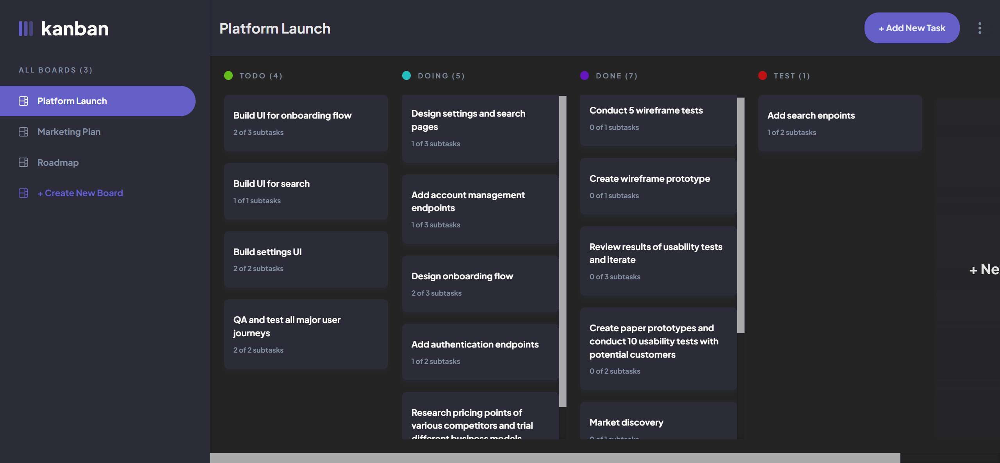

# Frontend Mentor - Kanban task management web app solution

This is a solution to the [Kanban task management web app challenge on Frontend Mentor](https://www.frontendmentor.io/challenges/kanban-task-management-web-app-wgQLt-HlbB). Frontend Mentor challenges help you improve your coding skills by building realistic projects. 

## Table of contents

- [Frontend Mentor - Kanban task management web app solution](#frontend-mentor---kanban-task-management-web-app-solution)
  - [Table of contents](#table-of-contents)
  - [Overview](#overview)
    - [The challenge](#the-challenge)
    - [Screenshot](#screenshot)
    - [Links](#links)
  - [My process](#my-process)
    - [Built with](#built-with)
    - [What I learned](#what-i-learned)
    - [Continued development](#continued-development)
  - [Author](#author)

## Overview

### The challenge

Users should be able to:

- [ ] View the optimal layout for the app depending on their device's screen size
- [x] See hover states for all interactive elements on the page
- [x] Create, read, update, and delete boards and tasks
- [ ] Receive form validations when trying to create/edit boards and tasks
- [x] Mark subtasks as complete and move tasks between columns
- [ ] Hide/show the board sidebar
- [ ] Toggle the theme between light/dark modes
- [x] **Bonus**: Allow users to drag and drop tasks to change their status and re-order them in a column
- [ ] **Bonus**: Keep track of any changes, even after refreshing the browser (`localStorage` could be used for this if you're not building out a full-stack app)
- [ ] **Bonus**: Build this project as a full-stack application

### Screenshot

### Links

- Solution URL: [Github Repo](https://github.com/yogeshdatir/kanban-task-management-web-app)
- Live Site URL: [Netlify Deployed Site](https://ydkanbanboard.netlify.app/)

## My process

### Built with

- Semantic HTML5 markup
- CSS custom properties
- Flexbox
- [React](https://reactjs.org/) - JS library
- [Redux Toolkit]() - App State Management Library
- [emotion Components](https://emotion.sh/) - For styles
- [TypeScript](https://www.typescriptlang.org/) - Type checking

### What I learned

This project is used to learn redux toolkit state management library.

Reusable React components -
- Modal
- Dropdown Menu
- Custom Single Select

### Continued development

- [ ] **Make room to maintain multiple modals.** 
  Example - In View Task Modal, delete task action triggers the confirmation modal(dialog). The cancel action of the confirmation modal should restore the View Task Modal with any updates if applicable.

- [ ] **Add animations in the app.**

## Author

- Website - [Yogesh D](https://github.com/yogeshdatir)
- Frontend Mentor - [My Profile](https://www.frontendmentor.io/profile/yogeshdatir)